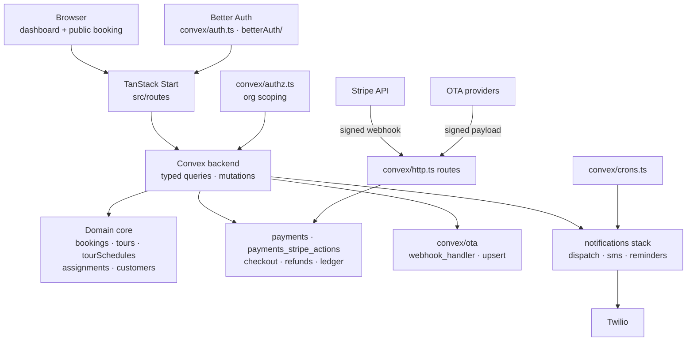

# guides-tours — Architecture

Multi-tenant tour-operator console: TanStack Start (SSR) frontend over a
Convex backend, deployed to Cloudflare Workers. Better Auth carries identity
and org scoping; Stripe runs checkout/refunds via signed webhooks; OTA
providers (Viator et al.) integrate through a dedicated webhook → upsert
pipeline; notifications fan out over SMS and push on crons.

## Modules

- src/routes — TanStack Start app: operator dashboard, public booking funnel
- convex/bookings · tours · tourSchedules — domain core and availability
- convex/assignments · drivers · availabilities — staffing and scheduling
- convex/payments · payments_stripe_actions · payments_stripe.ts — Stripe checkout, refunds, webhook-verified ledger
- convex/ota — provider integrations: webhook_handler, upsert, integrations_mutations
- convex/notifications* · phoneReminders · scheduledNotifications · crons.ts — dispatch, SMS, reminder crons
- convex/auth.ts · betterAuth/ · auth.config.ts · authz.ts — Better Auth + fail-closed org authorization
- convex/lib — validation, crypto, assignmentsLifecycle shared seams
- convex/http.ts — webhook surface (Stripe, OTA) with signature verification
